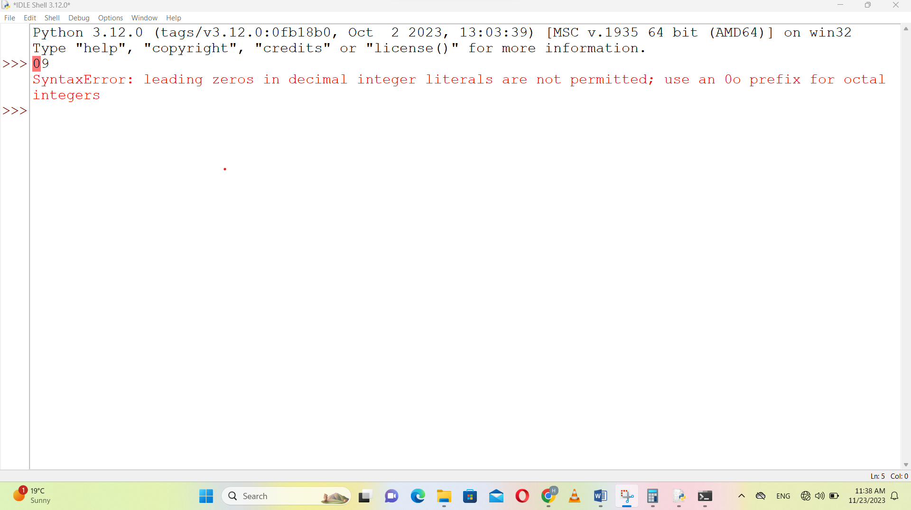

# Python Intro Homework Exercises

This repository contains my first Python homework assignments and coding experiments.  
Each script demonstrates fundamental programming concepts including printing, arithmetic operators, strings vs. integers, error handling, and working with dates and locations.

## Contents
- Printing names with quotations and parentheses
- Using multiplication (*) and power (**) operators
- Avoiding common syntax errors (quotes, leading zeros)
- Difference between numbers and strings
- Location and date print examples
- Simple math operations

All code is written and tested by myself as part of my learning journey.  
Feel free to review, ask questions, or provide feedback!

---

## Screenshots

### Part A — Errors in Python IDLE

Part A — Demonstrating common Python errors using print statements in IDLE. Shows SyntaxError for missing quotes, missing parentheses, and using names without quotes. These errors help new learners understand how to debug code.

### Part B — Arithmetic Operations
  
Part B — Python arithmetic operations. Shows correct outputs for multiplication (*) and power (**) operators in Python.

### Part C — Integer and String Type
  
Part C — Demonstrating the difference between integer and string in Python using the type() function in Command Line. Shows how Python distinguishes between int and str data types.

### Part D — Printing Location, Date, Temperature
  
Part D — Printing location, date range, and temperature in Python IDLE. Shows correct use of the print() function for displaying text information such as city, country, start/end dates, and temperature values.

### Additional — Leading Zero Error
  
Additional — Leading zero error in Python. Shows SyntaxError for using leading zeros in integer literals, helping to understand numeric syntax rules.

---

Hamida Nazari

