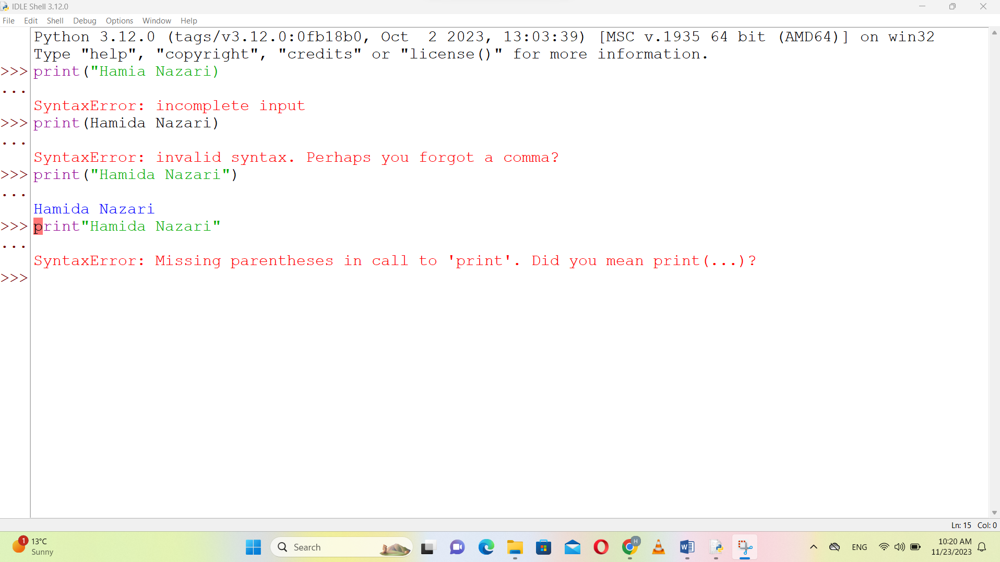
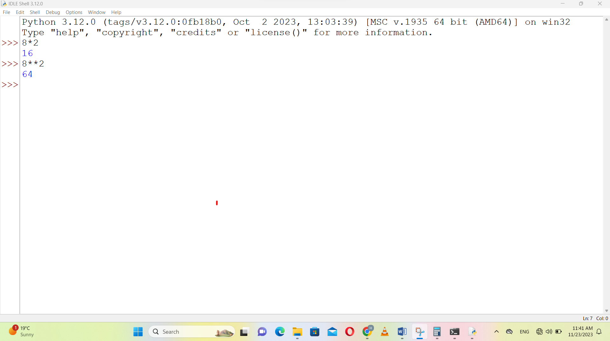
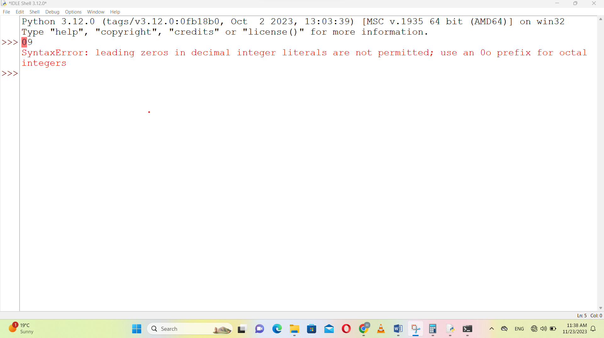
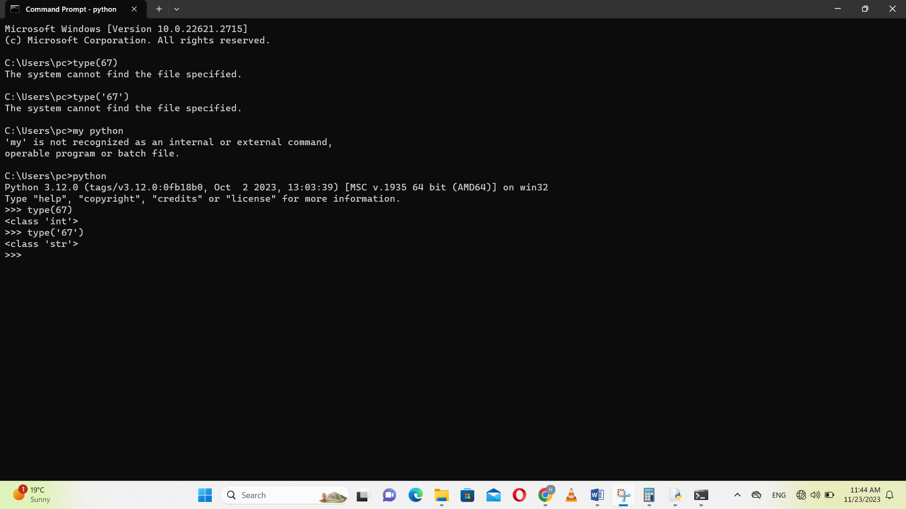
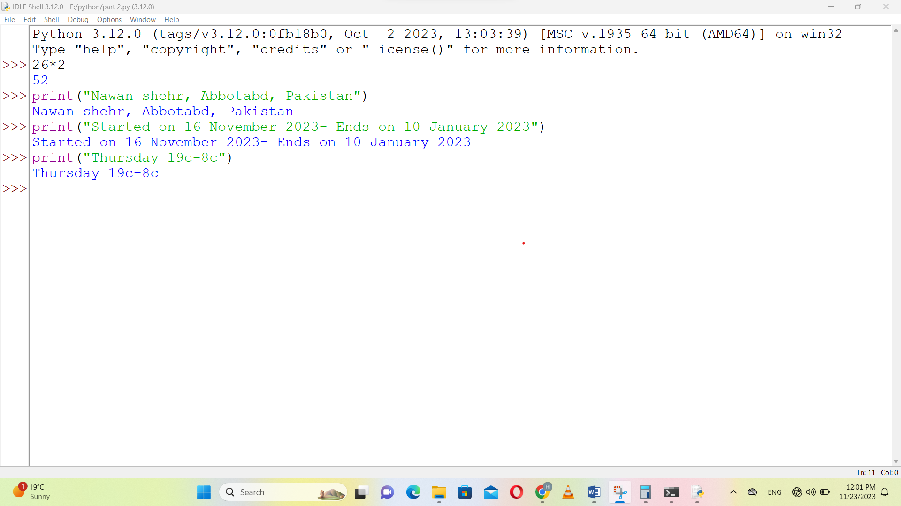
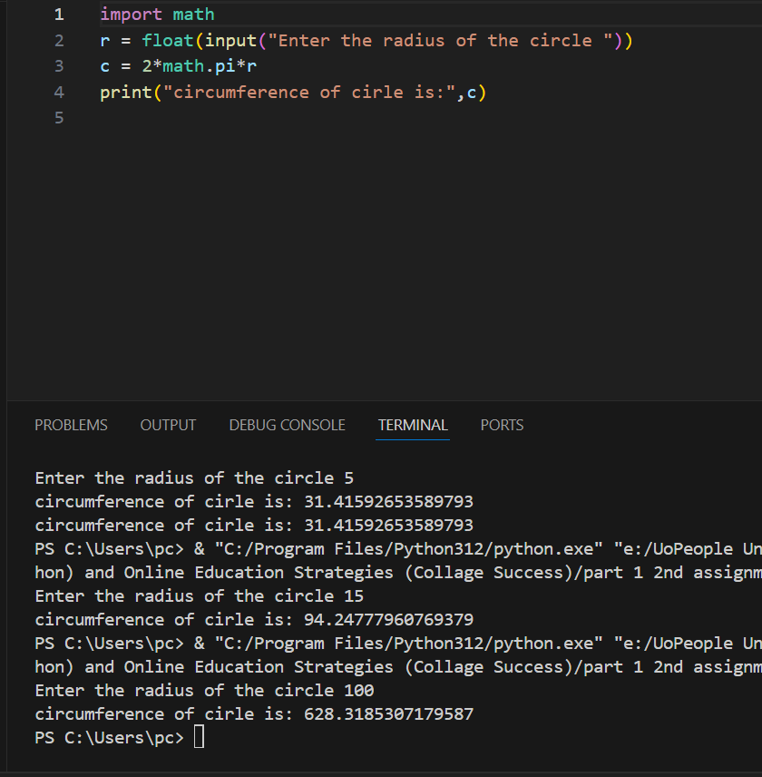
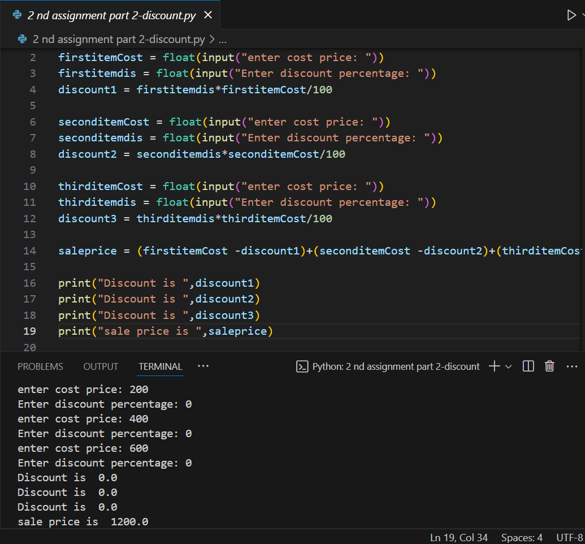
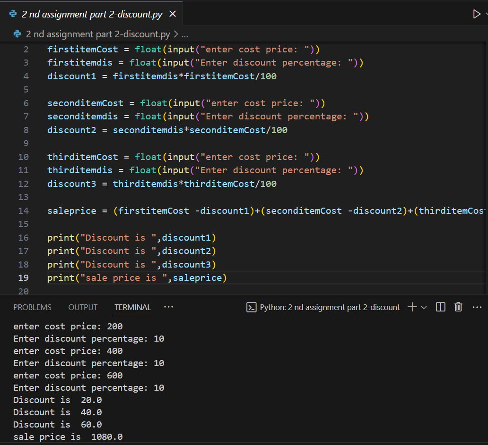
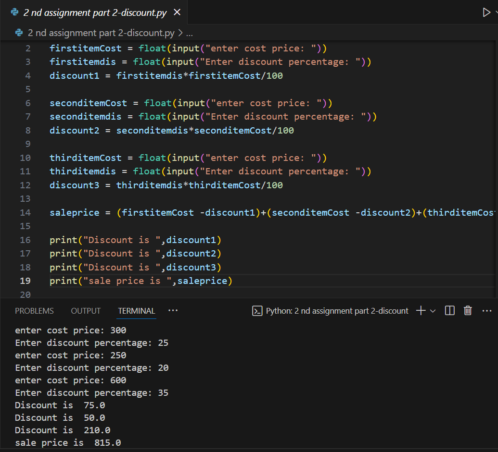

# Python Intro Homework Exercises

This repository contains my first Python homework assignments and coding experiments in Python.
Each script demonstrates basic programming concepts such as printing, arithmetic operators, error handling, working with strings and numbers, and simple calculations.

---

## Contents

- [Assignment 1: Python Basics & Error Handling](#assignment-1-python-basics--error-handling)
- [Assignment 2: Circle Circumference & Discount Calculator](#assignment-2-circle-circumference--discount-calculator)
- [Screenshots](#screenshots)

---

## Assignment 1: Python Basics & Error Handling

**Topics covered:**
- Printing names with quotations and parentheses
- Using multiplication (`*`) and power (`**`), math operations
- Common syntax errors (quotes, parentheses, leading zeros)
- Difference between numbers and strings
- Printing location, date, and temperature

**Full source code:** [assignment1.py](assignment1.py)

---

## Assignment 2: Circle Circumference & Discount Calculator

**Topics covered:**
- Calculating the circumference of a circle from user input (`C = 2 * π * r`)
- Calculating sale price and discounts for:
  - Single items (no discount)
  - Combo packs (two items, 10% discount each)
  - Gift packs (three items, 25% discount each)

**Circle Calculation examples:**
- Input: 5 → Output: circumference = 31.4159
- Input: 15 → Output: circumference = 94.2478
- Input: 100 → Output: circumference = 628.3185

**Discount Calculation examples:**
- Single item: cost = 200, discount = 0% → Sale price = 200.0
- Combo pack: items = 200 & 400, discounts = 10% → Sale price = 540.0
- Gift pack: items = 200, 400, 600, discounts = 25% → Sale price = 900.0

**Full source code:** [assignment2.py](assignment2.py)

---

## Screenshots
**Assignment 1**

### Part A — Errors in Python IDLE

Part A — Demonstrating common Python errors using print statements in IDLE. Shows SyntaxError for missing quotes, missing parentheses, and using names without quotes. These errors help new learners understand how to debug code.

### Part B — Arithmetic Operations
  
Part B — Python arithmetic operations. Shows correct outputs for multiplication (*) and power (**) operators in Python.

### Part C — Leading Zero Error
  
Part C — Leading zero error in Python. Shows SyntaxError for using leading zeros in integer literals, helping to understand numeric syntax rules.

### Part D — Integer and String Type
  
Part D — Demonstrating the difference between integer and string in Python using the type() function in Command Line. Shows how Python distinguishes between int and str data types.

### Part 2 — Printing Location, Date, Temperature
  
Part 2 — Printing location, date range, and temperature in Python IDLE. Shows correct use of the print() function for displaying text information such as city, country, start/end dates, and temperature values.

---

**Assignment 2**

  
*Circumference outcomes for several radii.*

*Sale price calculations for single, combo, and gift packs.*

---

## Author

Hamida Nazari

---

## Feedback

All code written and tested by myself as part of my Python learning journey.  
Feel free to review, ask questions, or provide feedback!

